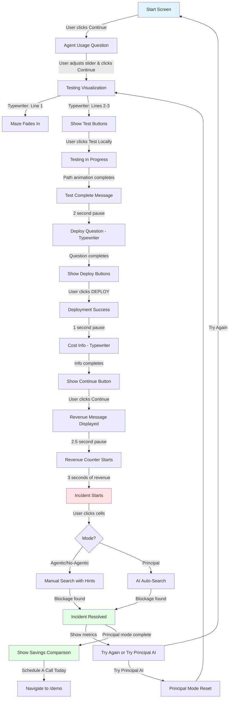

# Game Flow Documentation

This document describes the interactive maze game flow that demonstrates the value of Principal AI's telemetry for incident response.

## Flow Diagram

## Key Timings

- **Test Complete pause**: 2 seconds (to read success message)
- **Deploy question delay**: Immediate after Test Complete pause
- **Cost info delay**: 1 second after deployment
- **Revenue message delay**: Immediate after Continue clicked
- **Revenue counter start**: 2.5 seconds after revenue message (time to read)
- **Incident start**: 3 seconds after revenue counter starts
- **Path reveal animation**: 50ms per cell
- **Typewriter speeds**:
  - Start heading: 50ms per character
  - Start paragraph: 30ms per character
  - Agent question: 50ms per character
  - Testing lines: 35-50ms per character
  - Deploy question: 40ms per character
  - Cost info: 40ms per character

## Key States

### Flow States (UI State Machine)
See `src/app/game/types.ts` for the complete state machine definition.

- `start`: Initial screen with intro text
- `agent-question`: Agent usage question with slider
- `testing-intro`: Testing visualization intro text
- `testing-running`: Test path animation in progress
- `test-complete`: Test complete message displayed
- `deploy-question`: Asking if ready to deploy
- `cost-info`: Showing incident cost information
- `deployed-running`: Deployed, revenue accumulating
- `incident-active`: Incident happening, user searching
- `incident-resolved`: Blockage found, showing results
- `principal-comparison`: Showing Principal AI comparison

### Mode States (Game Behavior)
- `agentic`: Testing/deployment with agent-based development (variable visibility)
- `no-agentic`: Testing/deployment without agents (full visibility)
- `principal`: Testing/deployment with Principal AI (automated telemetry-based search)

### UI States
- `testedLocally`: Whether local tests have run
- `deployed`: Whether code is deployed to production
- `started`: Whether incident has started
- `blockageFound`: Whether user found the blockage
- `continueClicked`: Whether user clicked Continue after cost info
- `startRevenue`: Whether revenue counter should start

## Revenue & Cost Calculations

- **Incident cost per second**: Fixed at $225/sec (average of $150-$300 range)
- **Revenue accumulation rate**: $225/sec (same as incident cost)
- **Manual inspection cost**: $500 per cell click
- **Time cost**: Accumulates at $225/sec during incident
- **Total incident cost**: Time cost + Click cost

## Mode Differences

### No-Agentic Mode
- Full visibility during testing (opacity controlled by agent usage slider)
- User must manually search for blockage during incident
- Receives directional hints every 5 clicks

### Agentic Mode
- Reduced visibility during testing (higher agent usage = less visibility)
- User must manually search for blockage during incident
- Receives directional hints every 5 clicks

### Principal Mode
- Telemetry visualization during testing
- Automated search during incident (clicks from last telemetry point to blockage)
- Shows savings comparison vs previous mode
