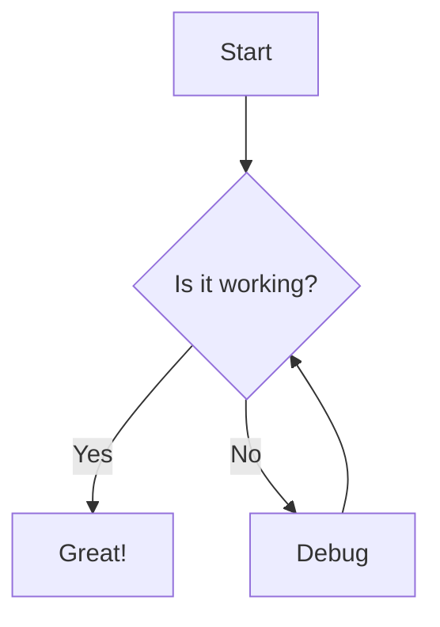

# Markdown Rendering in Principal ADE

**Published:** October 1, 2025
**Author:** Principal Team

One of the core features of Principal ADE is beautiful, customizable markdown rendering. Let's explore how it works.

## Why Markdown Matters

In modern development workflows, markdown is everywhere:

- Documentation
- README files
- Agent outputs
- Task descriptions
- Code comments

Having a great markdown viewer isn't just nice to have - it's essential.

## Themed Markdown

We use our custom `themed-markdown` library that provides:

### Multiple View Modes

- **Book Mode** - Read multiple sections like turning pages in a book
- **Single Mode** - Traditional single-page scrolling view
- **Presentation Mode** - Convert markdown into beautiful slides

### Code Highlighting

```typescript
import { DocumentView } from 'themed-markdown';

const MyComponent = () => {
  return (
    <DocumentView
      content={markdownContent}
      showNavigation={true}
    />
  );
};
```

### Mermaid Diagrams

We support Mermaid diagrams for visualizing:



### Theme Customization

Choose from multiple themes:

- Terminal (classic green on black)
- Regal (sophisticated purple and gold)
- Glassmorphism (modern translucent design)
- Matrix (green code rain aesthetic)
- Slate (professional gray tones)

## Using DocumentView

The `DocumentView` component makes it easy to render markdown with all these features:

```typescript
import { DocumentView, ThemeProvider } from 'themed-markdown';

function BlogPost({ content }) {
  return (
    <ThemeProvider theme={currentTheme}>
      <DocumentView
        content={content}
        showNavigation={true}
        containerHeight="100vh"
      />
    </ThemeProvider>
  );
}
```

## Advanced Features

### Search

Quickly search through your markdown content with built-in search functionality.

### Navigation

Automatic table of contents generation from your headers makes navigation a breeze.

### Zoom and Pan

For complex diagrams and images, zoom and pan controls let you see every detail.

---

*Explore these features yourself by downloading Principal ADE and trying different themes with your own markdown documents.*
