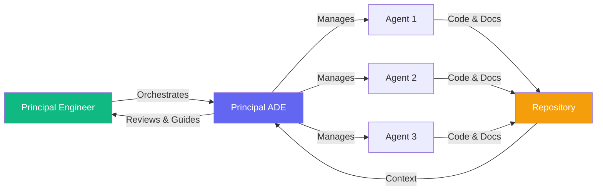
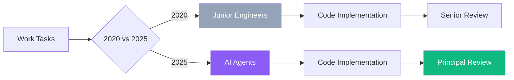
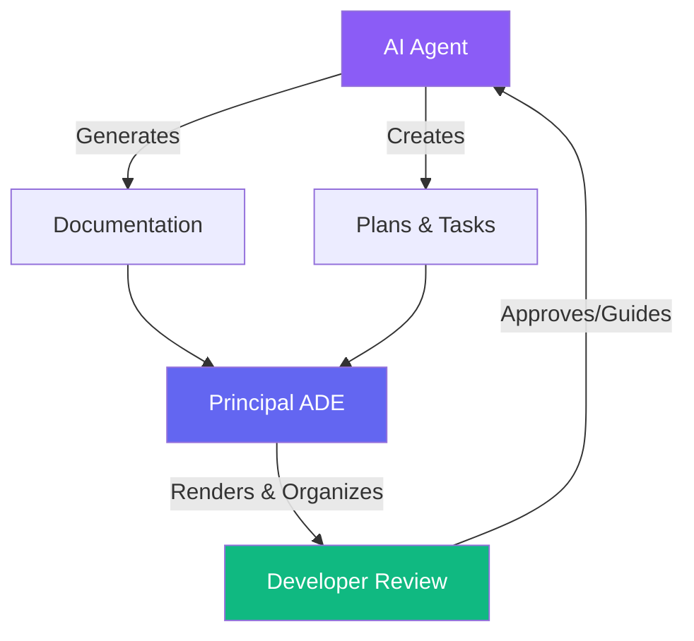
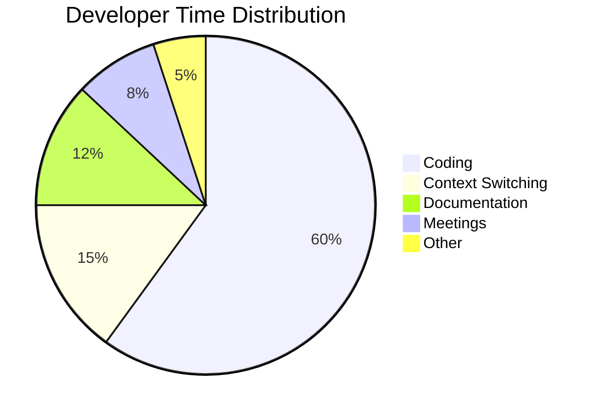
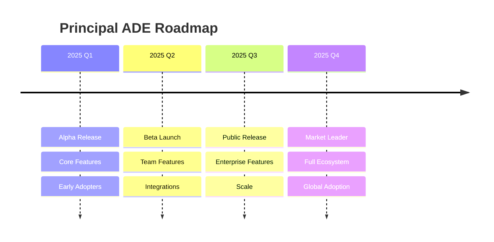

  <h1 style="font-size: 5em; margin: 0 0 20px 0; font-weight: 800;">Principal ADE</h1>
  
The Development Environment For Principal Engineers

## The Problem

  
There is no more Junior engineer work.

  
There are only Principal engineers in training.

  

    
❗ The bar for software engineers has risen dramatically

    
✗ AI has eliminated routine coding tasks

    
↑ Every developer must now think at a higher level

  

  
The challenge: How do we accelerate the journey from junior to principal?

## Our Solution

  
Principal ADE

  
The Platform facilitating agentic orchestration by improving the development experience for agents

  

    
Manage any coding agent from one unified interface

    
Review and guide agent decisions in real-time

    
Focus on architecture while agents handle implementation

  

## Key Features

  
Making Agent Work Accessible & Reviewable

## Still An Editor

  
Yes, you can still edit files.

  
Our Agentic Development Environment supports traditional file editing like any other code editor.

  
But manual editing has taken a backseat to agentic features.

## Market Opportunity

The AI-assisted development market is growing rapidly:
- Developers spend 40% of their time on non-coding activities
- AI coding assistants are becoming ubiquitous
- Need for better context management and agent orchestration is critical

## Business Model

- **Free Tier**: Core features for individual developers
- **Team Plan**: Advanced collaboration features
- **Enterprise**: Custom deployment and support

## Traction

- Alpha release ready for download
- Built on proven open-source technology (a24z-memory)
- Active development and community engagement

## The Team

We're a team of experienced engineers passionate about improving developer workflows and making AI agents more accessible and manageable.

## Vision

To become the standard environment for autonomous development, where teams can seamlessly collaborate with AI agents and maintain perfect engineering context across all their projects.

## Call to Action

Ready to experience the future of development?

**Download the Alpha Today**

Visit: [Principal ADE](/)
