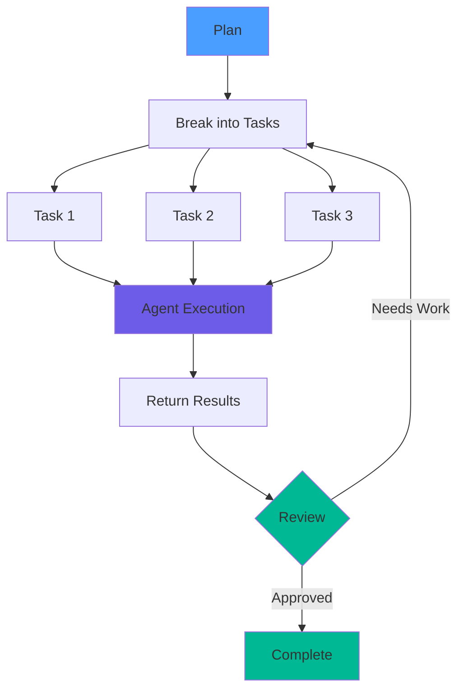

# Rules of Agentic Development

## 1) Markdown and Diagrams

This diagram demonstrates how Principal ADE orchestrates development work through intelligent agents, breaking down complex tasks into manageable pieces and ensuring quality through iterative review.
